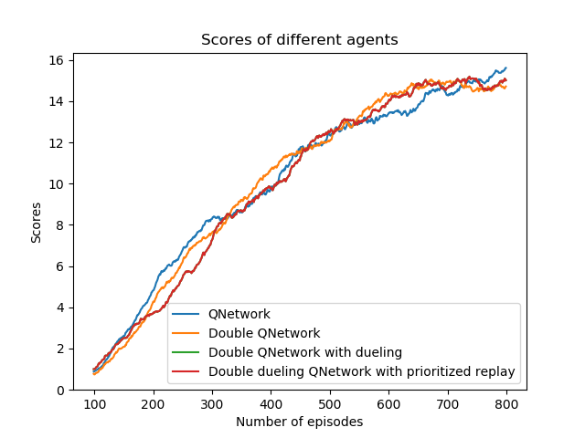
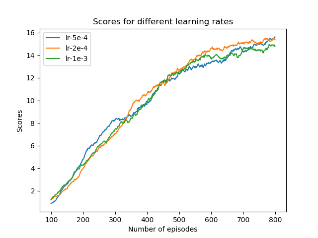

# Deep Reinforcement Learning - P1 Banana Navigation

## Overview

Deep reinforcement learning was applied to the Banana-collecting unity environment and variants of [Deep Q](https://arxiv.org/abs/1312.5602.pdf) and [Double Deep Q](https://arxiv.org/pdf/1509.06461.pdf), [dueling Deep Q](https://arxiv.org/abs/1511.06581v3) agents were able to solve the game (defined as an average score above 13.0 over 100 episodes).

## Architectures

The base architecture employed was a Deep Q Network (DQN), Double Deep Q (DDQ) agent and dueling DDQ and dueling DQ Network agent with an experience replay, with soft updating weights between the network and target network. A DDQ agent employs two neural networks, named the local and the target network. The purpose of the local network is to select greedy actions for the agent to follow with 1-epsilon chance. The local network is trained by minimising the loss between the predicted state-action pairs and the observed reward plus discounted next state value from the target network. Occasionally, the target network is updated via a soft update, which partially copies the weights of the local network to the target network. The use of two networks is to decouple selection from evaluation, whereas a single network can lead to overestimation of state-action values.
A Dueling Network is a type of Q-Network that has two streams to separately estimate (scalar) state-value and the advantages for each action. The two streams are combined via a special aggregating layer to produce an estimate of the state-action value function Q. 

A [prioritised experience replay](https://arxiv.org/pdf/1511.05952.pdf) with adaptive priority strength was also implemented in order for the agent to learn from its larger mistakes more often, potentially converging faster than uniformly sampling experiences.

## Hyperparameters

The `epsilon_decay` controls the rate at which epsilon (the chance of randomly selecting an action) decays with respect to the number of frames seen. The `min_epsilon` parameter is the minimum value that epsilon can take. The default values

```
epsilon_decay=0.995
min_epsilon=0.01
```

were selected.

The following hyperparameters were set by the network, where `fc_layers` specifies two hidden layers with size 64 each as default. This configuration was chosen as a reasonable balance of capturing non-linearity and keeping the network from being overly complex. The dueling network has 256 units.

```
batch_size=64
gamma=0.99
tau=1e-3
lr=2X10^-4, 5X10^-4, 10^-3
update_every=4
fc_layers=64,64
dueling unit=256
```


## Results

The uniform and prioritised experience replay Deep Q agents were each trained once using the default parameters until they reached an average score of 13.0 across 100 episodes. The training progresses of each are shown below.



These results suggest that the priority replay does not help, however, it is much more likely this is just down to chance as a different random seed may yield different results. The network was trained for three different sets of learning rates. The effect of learning rate is shown in below figure. 



The model weights from the trained agents were placed in the path `saved_model`.

## Future Improvements

Solving this environment could be improved with the following

- Perform stability analysis of training using different random seeds
- Implement a [distributional DQN](https://arxiv.org/pdf/1707.06887.pdf)
- Implement a [noisy DQN](https://arxiv.org/pdf/1706.10295.pdf)
- Implement a [rainbow network](https://arxiv.org/pdf/1710.02298.pdf)
- Learn from the raw screen pixels